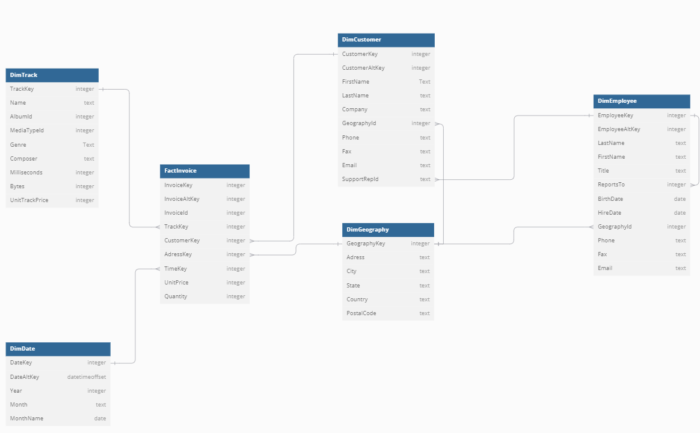

# ChinookMusicWarehouse

## Overview
This is a simple ETL project that loads music purchase data from a JSON file containing OLTP database data into an OLAP data warehouse using Azure Synapse Analytics.

### Data Loading and Transformation
The data from a `.json` file was manually loaded into an Azure container linked with Azure Synapse Analytics. It was then transformed using the PySpark pool in Azure Synapse. A dataframe was created for each table from the OLTP database, and the data was saved in Parquet and Delta formats.

In the dedicated SQL Pool, external tables were created based on the transformed data. These tables were used to create staging tables for the data warehouse. The result was a fully functional data warehouse in Azure Synapse Analytics’ dedicated SQL pool, ready for further analysis using SQL queries, Power BI, or other tools.

## Data Warehouse Schema

### Data Source
The data comes from: [https://github.com/lerocha/chinook-database](https://github.com/lerocha/chinook-database)  
Licensed under the MIT License (Copyright © 2008-2024 Luis Rocha)